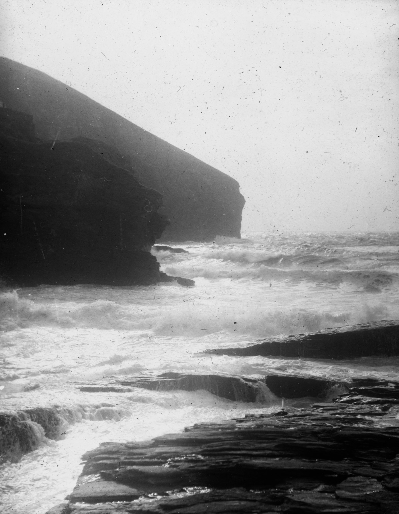
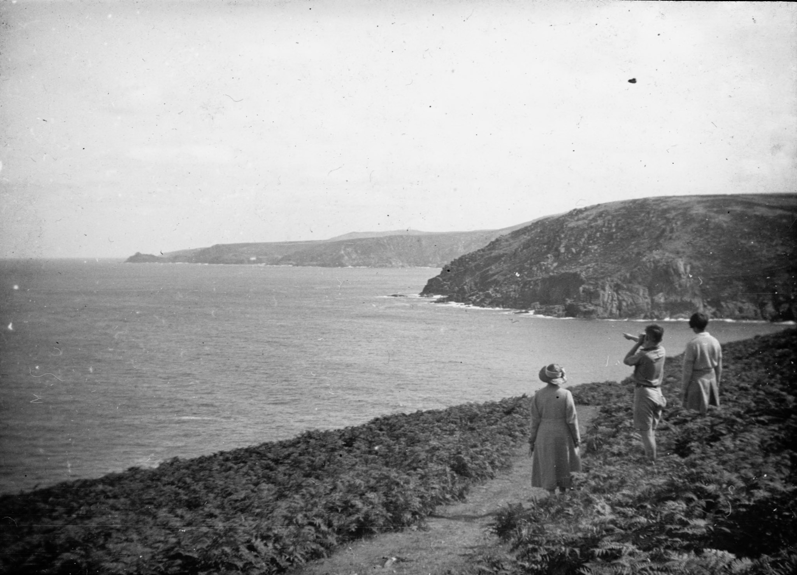
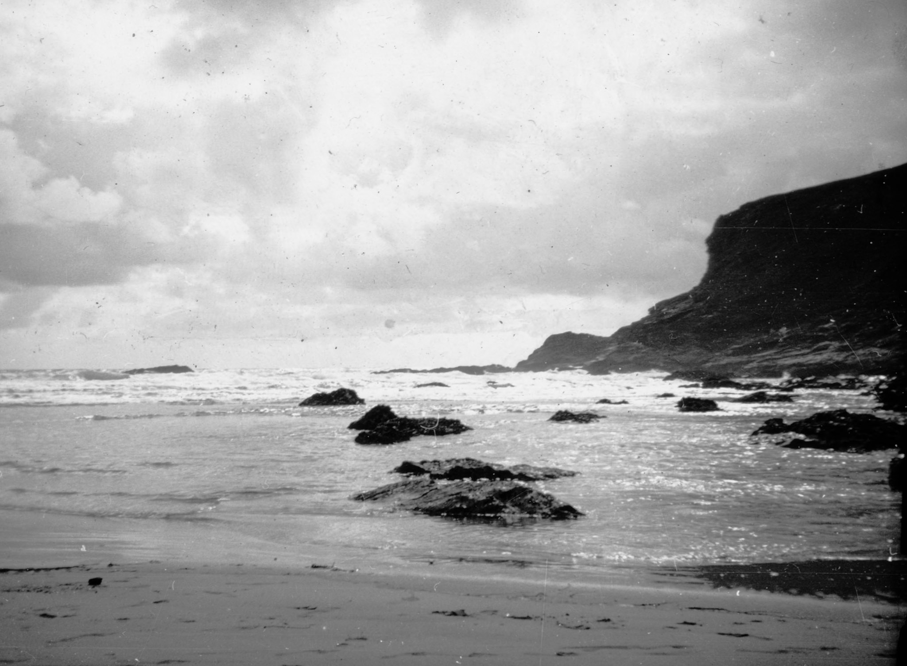
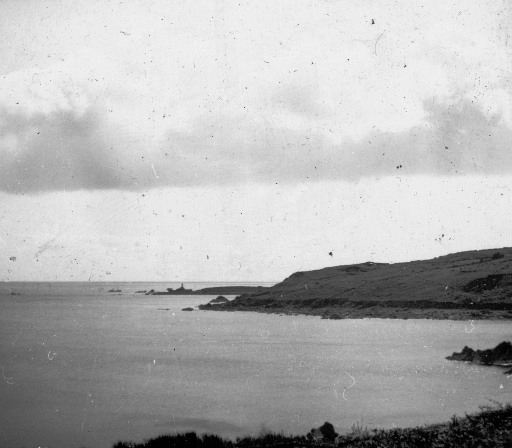
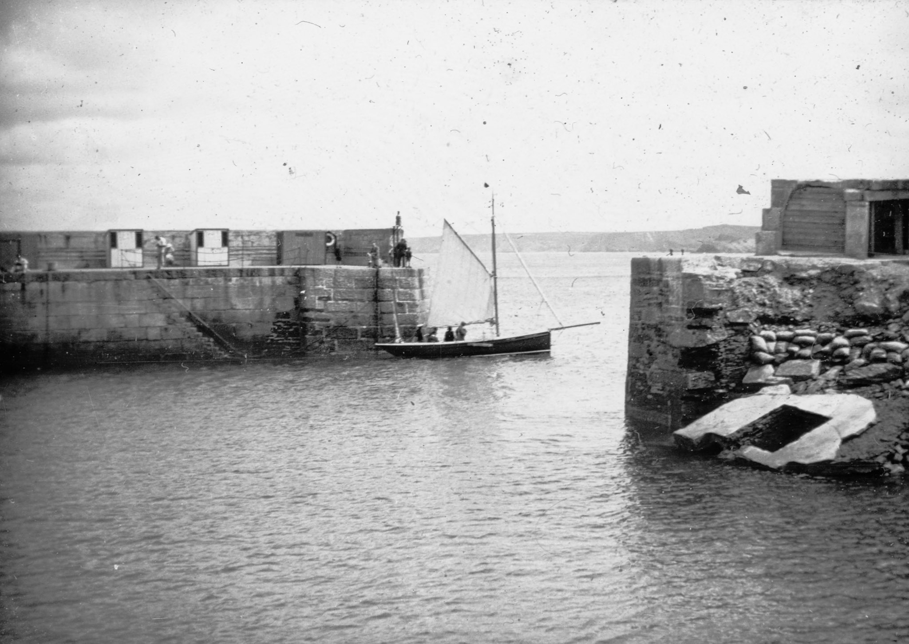
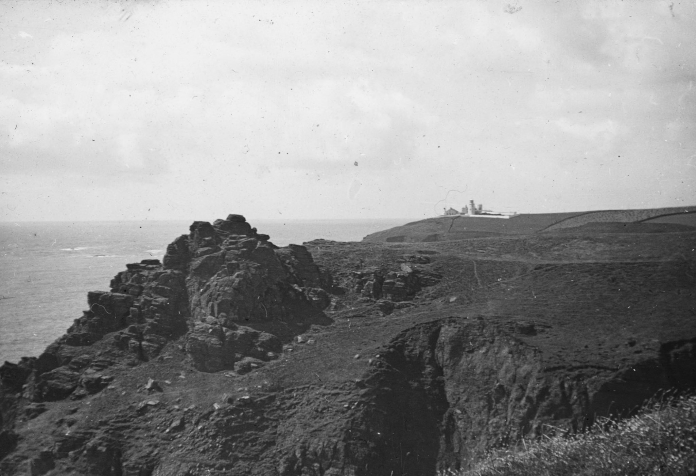
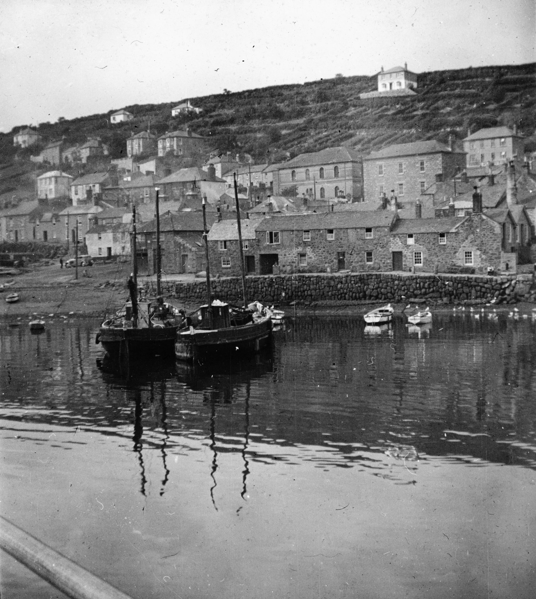
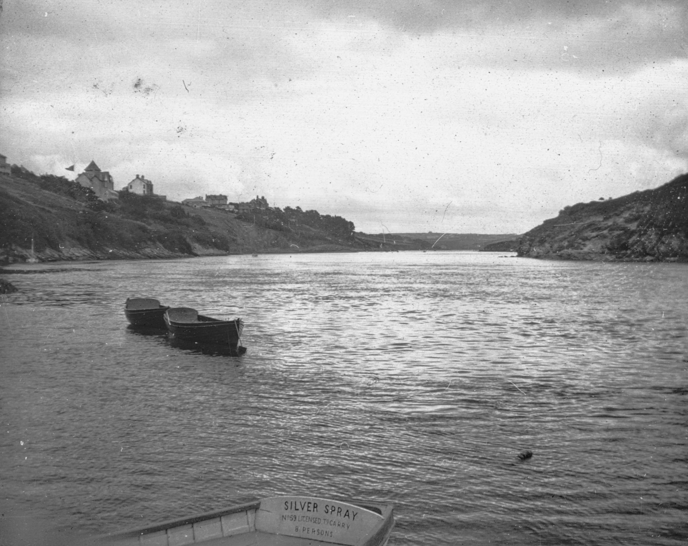
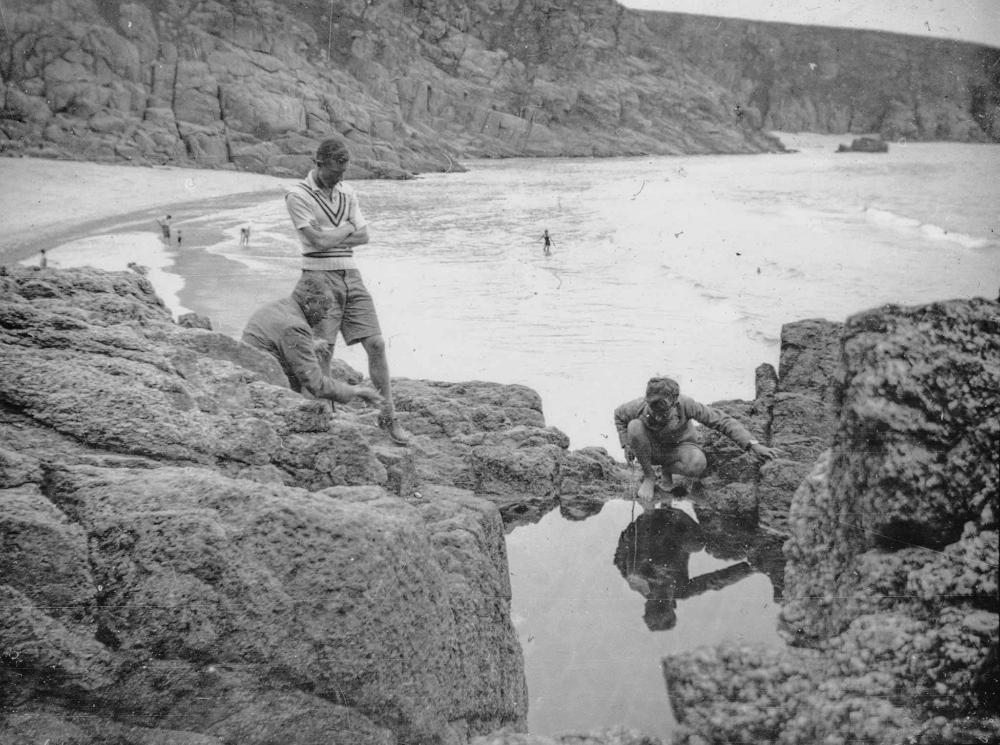
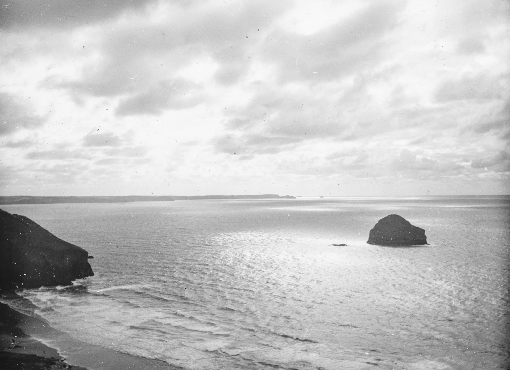

*← [[index|Christopher Patrick Silver]]*

|Cornwall||}}
Christopher Silver photographed Cornwall extensively — its rugged coastline, harbours, and fishing villages. These images were taken on Ilford glass plate stock and show Cornwall as it looked in the early-to-mid twentieth century, before mass tourism transformed many of its communities. Cornwall was the home county of CPS's nephew [Jago Silver](Jago-Silver), who still lives on the North Cornwall coast — a connection that gives these photographs a particular resonance.

## General coastal views

## Falmouth

Falmouth, on the south Cornish coast, has one of the world's largest natural harbours. By the time CPS visited, it was already established as a sailing and boat-building centre.

## Lizard Point

The Lizard is the southernmost point of mainland Britain. Its clifftops are dramatic serpentine rock, and the lighthouse has guided ships since 1619.

## Mousehole

Mousehole (pronounced *Mowzel*) is a small fishing village south of Penzance, widely considered one of the most picturesque harbours in Cornwall.

## The Gannel, Newquay

The Gannel is a tidal estuary at Newquay on the north Cornish coast — a quieter, more sheltered side of what would later become a busy seaside resort.

## Trebarwith Strand

Trebarwith Strand is a beach on the north Cornish coast near Tintagel, known for its dramatic rock formations and the small island of Gull Rock offshore.

## See also
- [Christopher Silver](Christopher-Silver) — main article
- [Christopher Silver/UK](Christopher-Silver/UK) — other UK locations
- [Christopher Silver/People](Christopher-Silver/People) — portraits and figures
- [Jago Silver](Jago-Silver) — lives in North Cornwall
