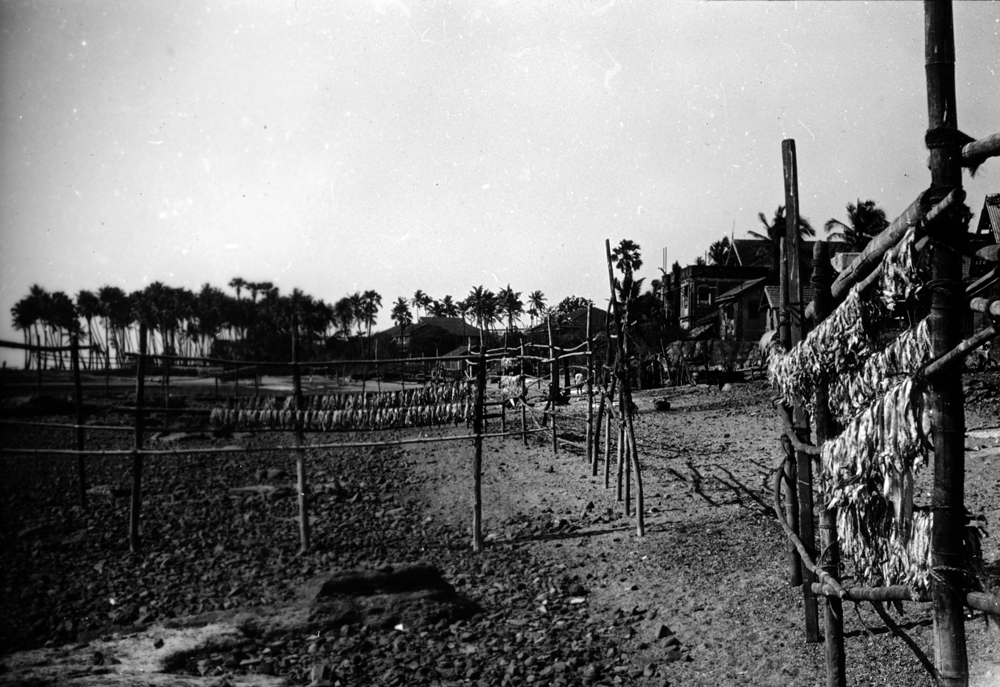

*← [[index|Christopher Patrick Silver]]*

Three photographs from Vietnam survive in the CPS collection — two unlocated scenes and one clearly identifiable as Saigon (now Ho Chi Minh City). The photographs appear to date from the mid-1940s, when CPS was serving with the RAMC in the Far East. Following the end of the Second World War in August 1945, British forces were briefly present in French Indochina to take the surrender of Japanese troops south of the 16th parallel, before handing the territory back to France in early 1946. CPS may have passed through Saigon during this period.

## General Vietnam

## Saigon

Saigon was the capital of French Indochina and the largest city in southern Vietnam. In the mid-1940s it was still largely a French colonial city, though the struggle for independence was already underway.

## See also
- [Christopher Silver](Christopher-Silver) — main article
- [Christopher Silver/India](Christopher-Silver/India) — RAMC service in India, 1944–46
