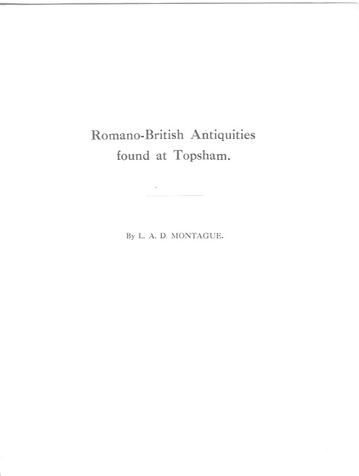
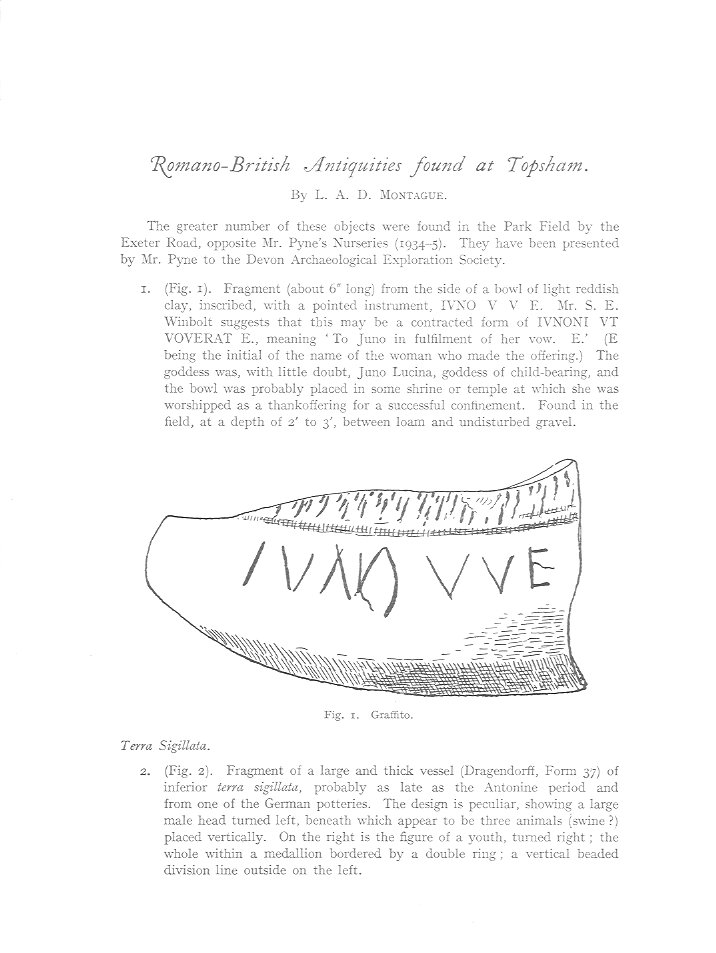
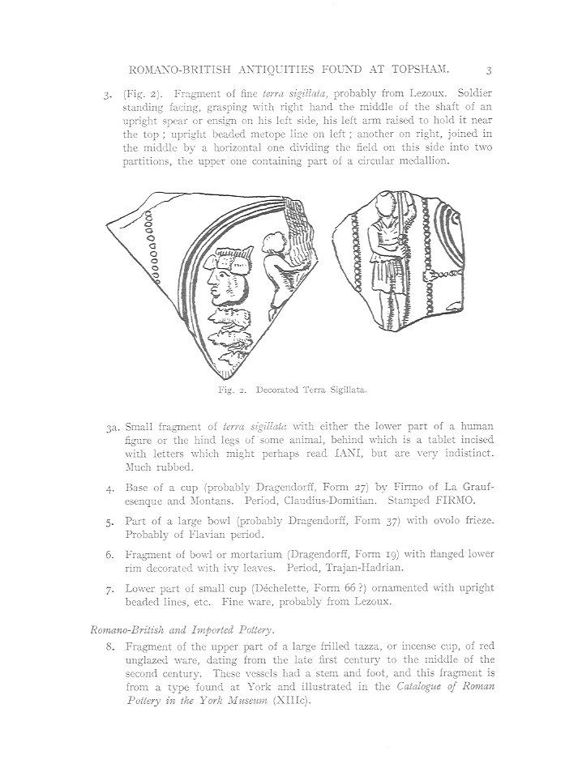
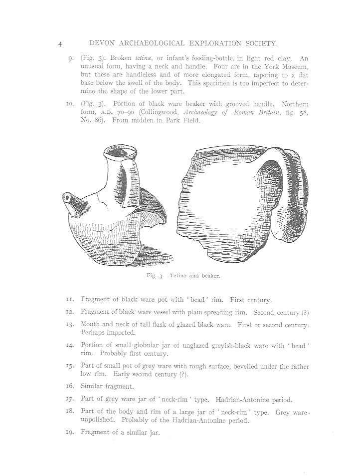
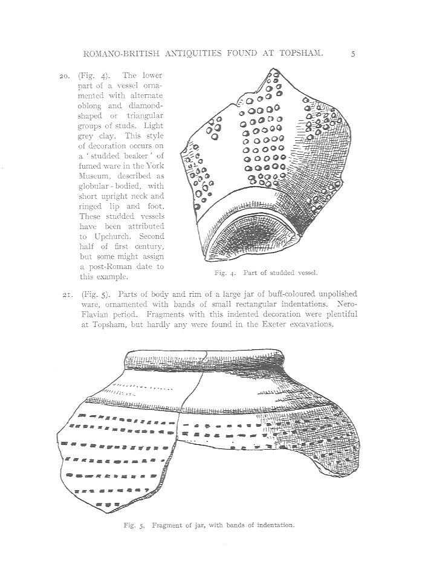
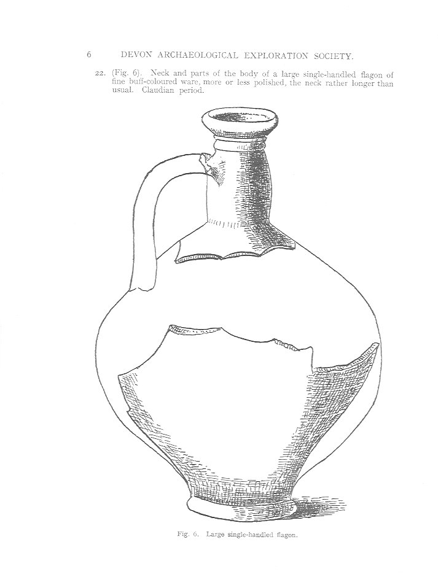
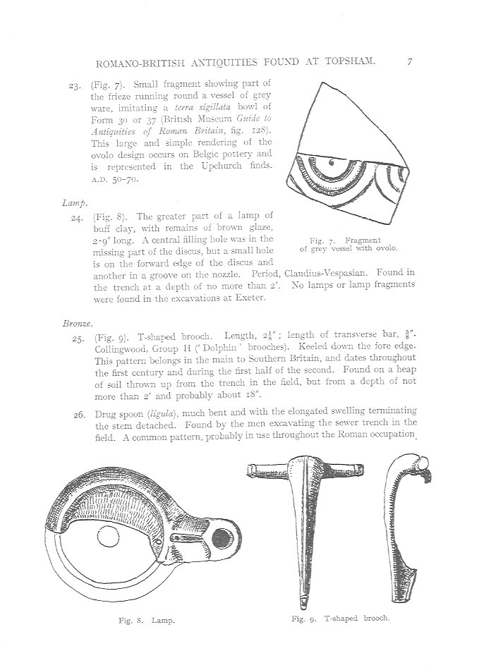
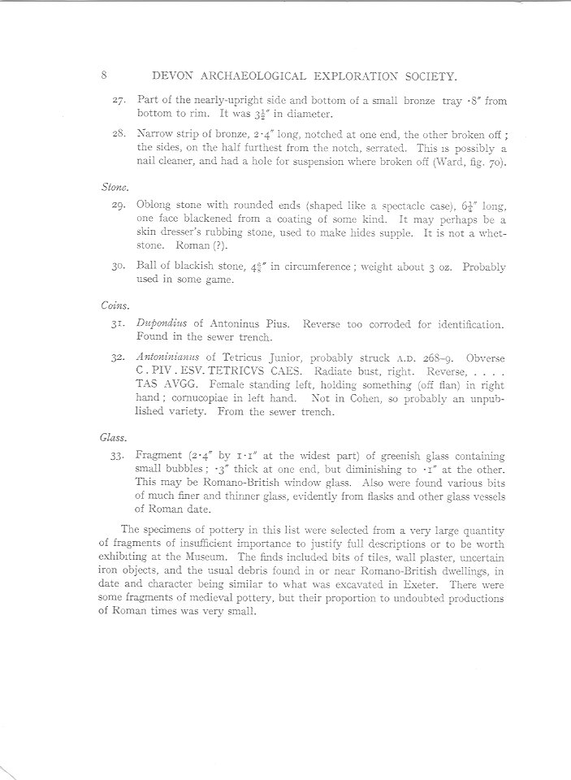

*← [Silver Family Archive](./) · [A Topsham Childhood](Anthea-Silver)*

# Romano-British Antiquities Found at Topsham

### By L. A. D. Montague

---

The site known as **Park Field** — by the Exeter Road, opposite Mr Pyne's Nurseries — was the land belonging to **Thomas Bolt Pyne**, Anthea Silver's grandfather. In 1934–35, excavation of a sewer trench through this field unearthed a remarkable collection of Romano-British objects, spanning roughly the first to third centuries AD. The finds were presented by Mr Pyne to the Devon Archaeological Exploration Society.

This report, published by L. A. D. Montague, catalogues pottery, bronze, stone, coins and glass recovered from the site — evidence that Topsham was a significant Romano-British settlement, likely connected to the Roman port and the nearby legionary fortress at Exeter (Isca Dumnoniorum).

For Anthea's own memories of Denver House and Denver Nurseries, see [Chapter 6 of *A Topsham Childhood*](Anthea-Silver#chapter-6-denver-house-and-denver-nurseries).

---

*Title page of Montague's report for the Devon Archaeological Exploration Society.*

---

## The Graffito and Terra Sigillata

The most striking find was a fragment of a bowl inscribed **IVNO V V E** — interpreted as a votive offering to Juno Lucina, goddess of childbearing, placed in a shrine as a thankoffering for a successful confinement. It was found at a depth of two to three feet, between loam and undisturbed gravel.

*Fig. 1: The graffito — a bowl fragment inscribed IVNO V V E, a contracted form of IVNONI VT VOVERAT E. Fig. 2: Decorated terra sigillata, probably from a German pottery of the Antonine period.*

Several pieces of *terra sigillata* (the fine red-gloss tableware of the Roman world) were recovered, including decorated fragments probably from Lezoux in central Gaul and from German potteries. One shows a soldier grasping a spear; another bears a large male head within a medallion.

*Fig. 2 (continued): Decorated terra sigillata. Items 3a–7 include cups stamped FIRMO (by Firmo of La Graufesenque, Claudius–Domitian period), bowls with ovolo friezes, and fine ware probably from Lezoux.*

---

## Romano-British and Imported Pottery

The domestic pottery tells the story of everyday life at the settlement: cooking vessels, storage jars, drinking beakers, and — most touchingly — a broken *tetina*, an infant's feeding-bottle in light red clay, unusual for having a neck and handle.

*Fig. 3: A broken tetina (infant's feeding-bottle) and a black ware beaker with grooved handle, A.D. 70–90. Items 11–19 catalogue fragments of black and grey ware spanning the first and second centuries.*

*Fig. 4: Part of a studded vessel in light grey clay, possibly from Upchurch (second half of the first century). Fig. 5: Fragment of a large jar ornamented with bands of small rectangular indentations — a type plentiful at Topsham but rare in the Exeter excavations.*

*Fig. 6: A large single-handled flagon of fine buff-coloured ware, Claudian period. Fig. 7: Fragment of grey ware imitating a terra sigillata bowl, A.D. 50–70.*

---

## Lamp, Bronze, Stone, Coins and Glass

*Fig. 7: Fragment of grey vessel with ovolo. Fig. 8: A lamp of buff clay with remains of brown glaze, Claudius–Vespasian period — no lamps were found in the Exeter excavations. Fig. 9: A T-shaped 'Dolphin' brooch, first to mid-second century, and a drug spoon (ligula).*

The bronze finds included a T-shaped brooch of Collingwood's Group H ('Dolphin' brooches), dating from the first century to the mid-second century, and a drug spoon (*ligula*) — a common pattern probably in use throughout the Roman occupation.

Two coins were recovered from the sewer trench: a *dupondius* of Antoninus Pius and an *antoninianus* of Tetricus Junior (struck c. A.D. 268–69), the latter probably an unpublished variety. A fragment of greenish glass may be Romano-British window glass.

*The closing entries of the catalogue: stone objects, coins and glass. The specimens of pottery were selected from a very large quantity of fragments found in or near the site.*

---

## Note on the Site

The finds came from Park Field and from a sewer trench cut through it in 1934–35. The field lay by the Exeter Road, opposite the nurseries run by **Thomas Bolt Pyne** — Anthea's grandfather, who presented the antiquities to the Devon Archaeological Exploration Society. In Anthea's memoir she describes Denver Nurseries as employing about thirty men, sending fruit trees all over Britain, and forming the most wonderful play place a child could imagine.

The character of the finds — domestic pottery, a feeding bottle, a brooch, a lamp, coins spanning two centuries — suggests not a military site but a civilian settlement, part of the Romano-British community that grew up around the port at Topsham and the legionary fortress at Exeter.

---

*Report transcribed from the original publication of the Devon Archaeological Exploration Society. Scanned pages from the Pyne family papers.*
